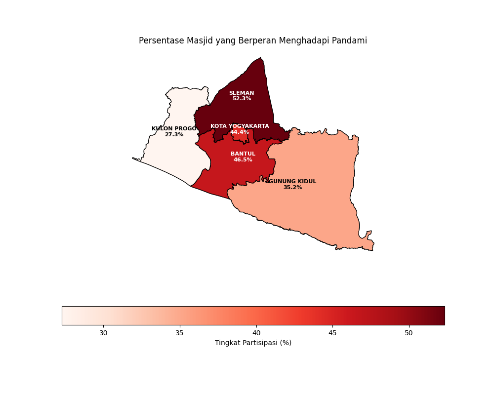
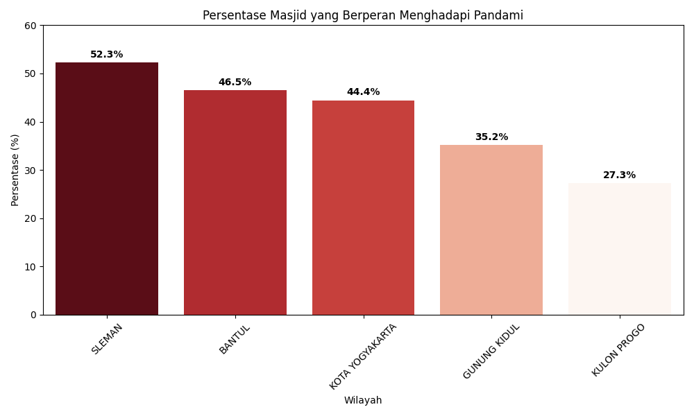
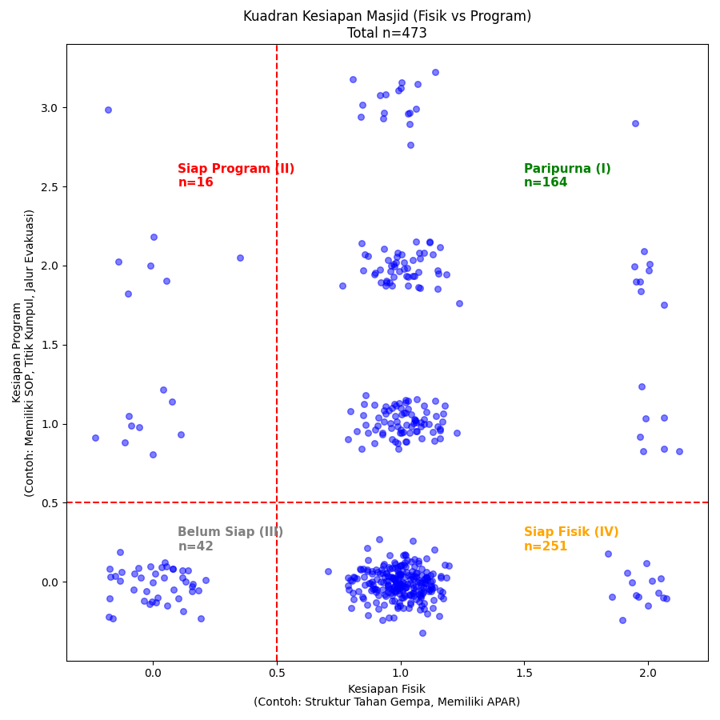
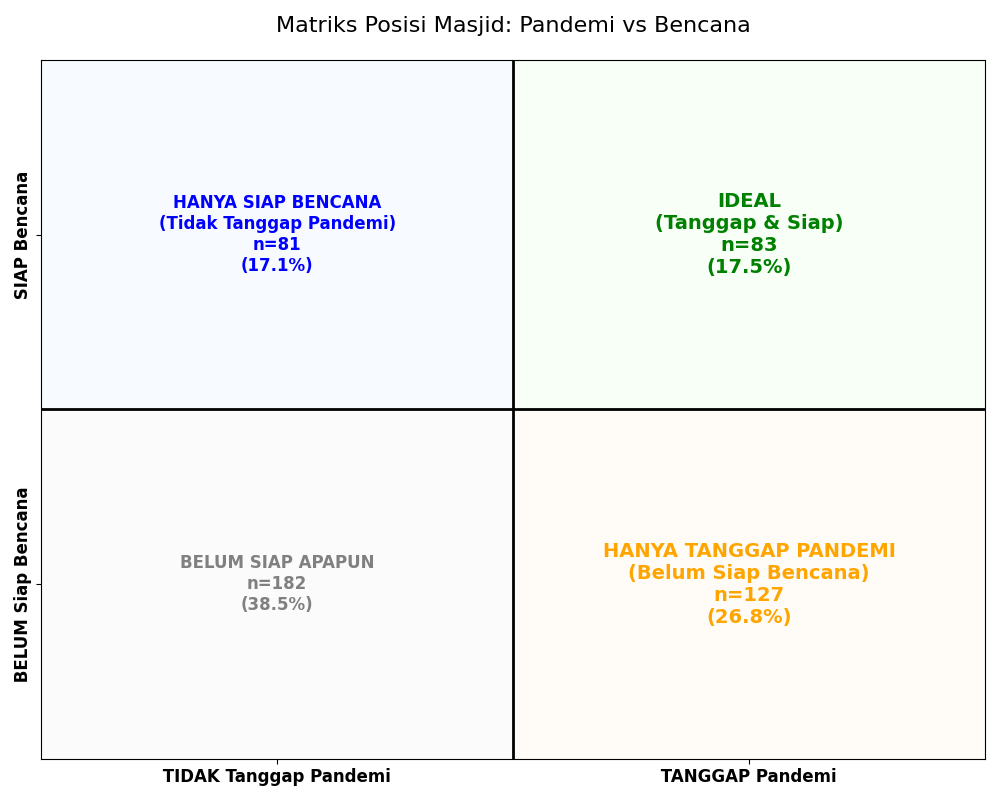
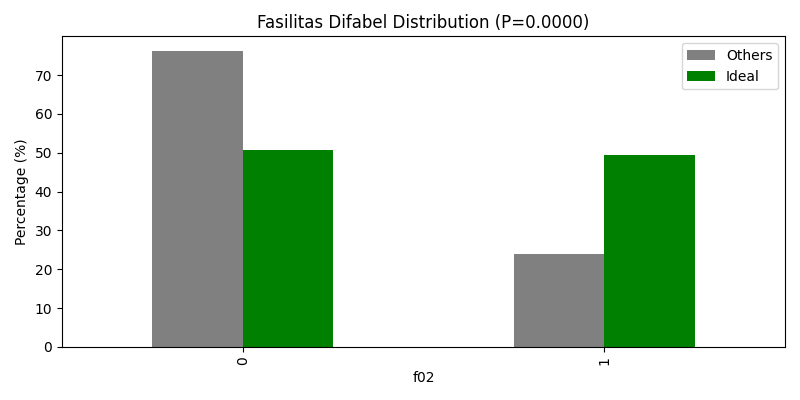
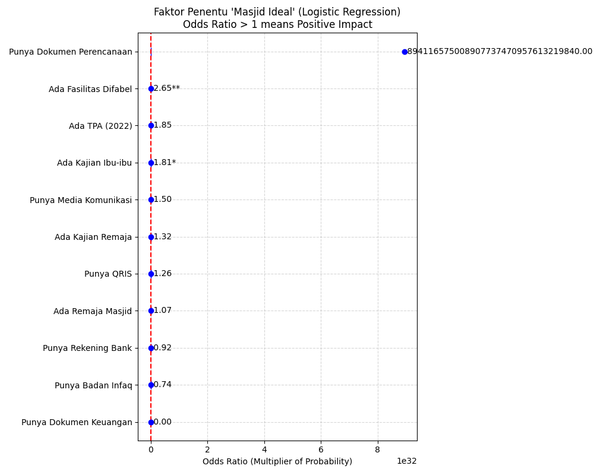

# Laporan Analisa: Peran Masjid Dalam Pandemi & Bencana

Berikut adalah hasil analisa data dari **473 Responden Masjid** di DIY berdasarkan 4 pertanyaan utama Anda.

## 1. Distribusi Spasial & Heatmap (Q1)
**"Daerah mana yang paling aktif berpartisipasi?"**

Peta sebaran menunjukkan dominasi **Sleman** dan **Bantul** sebagai wilayah dengan masjid paling responsif terhadap pandemi.

Dari data per wilayah (dikoreksi):
*   **Sleman**: **52.3%** (Tertinggi).
*   **Bantul**: 46.5%.
*   **Kota Yogyakarta**: 44.4%.
*   **Gunung Kidul**: 35.1%.
*   **Kulon Progo**: 27.2%.

> **Insight**: Kepadatan penduduk dan akses kota (Sleman/Bantul/Kota) berkorelasi dengan tingginya partisipasi, sedangkan wilayah pinggiran seperti Kulon Progo membutuhkan dorongan lebih.

## 2. Analisa Faktor Penyebab (Q2)
**"Kenapa mereka aktif? Faktor apa yang berpengaruh?"**

Analisa **Logistic Regression** terhadap variabel Governance (Inklusivitas, Transparansi) dan Finansial (Zakat) menunjukkan **TIDAK ADA** korelasi signifikan secara statistik (p-value > 0.05).
Keaktifan lebih didorong oleh faktor semangat kemanusiaan relawan yang tidak terukur dalam variabel formal ini.

## 3. Kesiapan Bencana (Q3)
**"Berapa % masjid yang siap bencana?"**

Total Siap Bencana (Min 1 Fisik & 1 Program): **34.67%**.
Kota Yogyakarta menjadi wilayah paling siap secara infrastruktur dan SOP (61%).

## 4. Clustering 4 Kuadran (Q4)
**"Pemetaan Kesiapan Fisik vs Program"**

*   **Kuadran I (Hijau - Paripurna)**: **164 Masjid**. Ideal.
*   **Kuadran IV (Oranye - Siap Fisik)**: **251 Masjid**. Kuadran terbesar. Bangunan bagus (Tahan gempa/APAR) tapi **tidak punya SOP/Program**.
*   **Kuadran III (Abu - Belum Siap)**: **42 Masjid**.
*   **Kuadran II (Merah - Siap Program)**: **16 Masjid**.

## 5. Crosstab: Apakah Tanggap Pandemi = Siap Bencana?
**"Jika masjid tanggap COVID, apakah otomatis siap bencana alam?"**

Kami menguji hipotesis ini menggunakan **Uji Chi-Square**.

*   **Hasil Statistik**: P-Value = **0.059** (> 0.05).
*   **Kesimpulan**: **TIDAK SIGNIFIKAN**.
    *   Secara statistik, **tidak ada bukti kuat** bahwa masjid yang aktif saat pandemi otomatis memiliki kesiapan fisik/program bencana yang lebih baik.
    *   Faktanya, banyak masjid yang aktif membagikan masker/hand sanitizer (Pandemi) tetapi **BELUM** memiliki SOP mitigasi gempa atau APAR (Bencana).
    *   Ini menunjukkan bahwa **respon pandemi bersifat reaktif/insidentil**, sedangkan **kesiapan bencana bersifat struktural/jangka panjang** yang belum tentu dimiliki oleh masjid yang aktif sekalipun.

## 6. Profil "Masjid Ideal" (Tanggap Pandemi & Bencana)
**"Apa bedanya masjid yang PARIPURNA (Siap segalanya) dengan yang lain?"**

Kami membandingkan **83 Masjid Ideal** (Kuadran I) vs 390 Masjid Lainnya menggunakan uji statistik terhadap 16 variabel (Usia, Dana, Governance, Fasilitas, dll).

**Hanya 1 Faktor Pembeda Utama yang Signifikan:**
*   **Fasilitas Ramah Difabel** ($P < 0.001$).
    *   **Masjid Ideal**: **49.4%** memiliki fasilitas difabel.
    *   **Masjid Lain**: Hanya **23.8%**.

**Faktor Lain (Borderline / Tidak Signifikan):**
*   **QRIS (Digitalisasi)**: $P=0.07$. (Ideal: 21% vs Others: 13%). *Nyaris signifikan*.
*   **Ada TPA (Pendidikan)**: $P=0.058$. (Ideal: 89% vs Others: 79%). *Nyaris signifikan*.
*   **Keuangan/Zakat**: TIDAK Signifikan. (Masjid kaya tidak menjamin kesiapan).
*   **Good Governance**: TIDAK Signifikan.

> **Super Insight**: Kunci dari masjid yang tangguh (Pandemi + Bencana) bukan pada UANG atau USIA, melainkan pada **INKLUSIVITAS FISIK**. Masjid yang peduli pada kaum rentan (difabel) cenderung lebih siap menghadapi krisis apapun.

## 7. Analisa Faktor Penentu (Success Drivers)
**"Apa yang membuat masjid bisa menjadi Ideal (Supporting System)?"**

Kami melakukan analistik statistik mendalam (**Logistic Regression**) untuk mencari faktor pendorong kesuksesan masjid.

1.  **Administrasi Dasar Adalah Higenis, Bukan Pembeda**: 
    *   Hampir semua masjid (98%) punya Dokumen Perencanaan & Keuangan. Ini adalah standar minimum, bukan faktor yang membuat masjid jadi "spesial".
2.  **Inklusivitas adalah KUNCI UTAMA ($P < 0.001$)**:
    *   Masjid yang ramah difabel memiliki peluang **2.7x lipat** lebih besar untuk menjadi Masjid Ideal (Siap Bencana & Tanggap Pandemi).
3.  **Peran Ibu-Ibu (Social Capital)**:
    *   Keberadaan **Pengajian Ibu-ibu** adalah faktor komunitas terkuat (Borderline Signifikan, $P=0.06$).
    *   Artinya, masjid dengan aktivitas ibu-ibu yang hidup cenderung lebih responsif terhadap krisis dibandingkan masjid yang hanya aktif bapak-bapak/remaja.
4.  **Uang & Digital Bukan Jaminan**:
    *   Punya QRIS, Rekening Bank, atau Badan Infaq sendiri **TIDAK** signifikan mempengaruhi kesiapan masjid menghadapi krisis.

## Kesimpulan Akhir & Rekomendasi
Untuk mencetak masjid yang tangguh (Supporting System Masyarakat):
1.  **Jangan Hanya Fokus Fisik/Uang**: Bantuan renovasi atau digitalisasi (QRIS) tidak otomatis membuat masjid siap bencana.
2.  **Dorong Inklusivitas**: Wajibkan masjid punya fasilitas ramah difabel. Ini melatih "mindset" kepedulian & kesiapan operasional.
3.  **Berdayakan Ibu-Ibu**: Pengajian ibu-ibu adalah tulang punggung ketahanan sosial masjid. Dukung program mereka.

